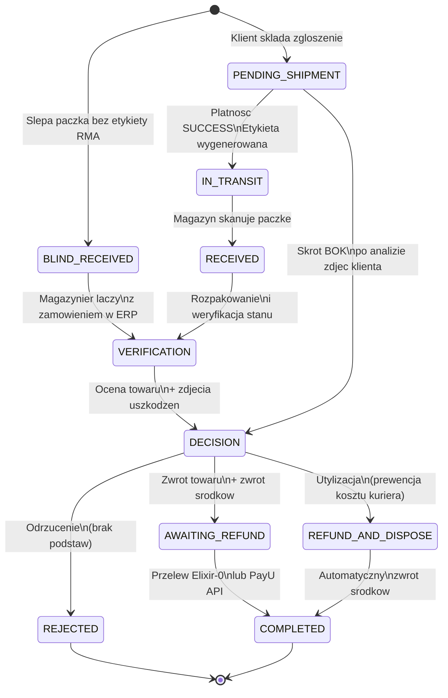
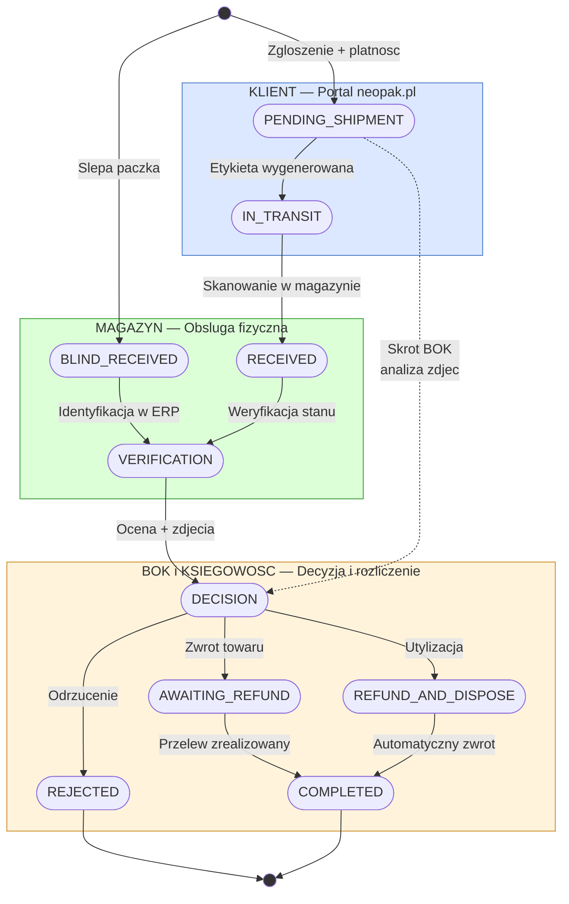
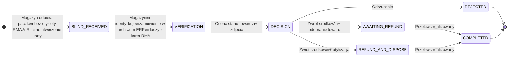
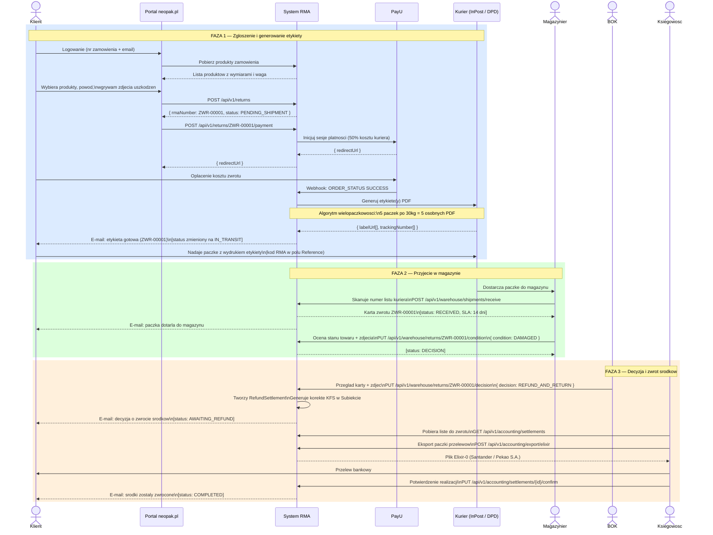
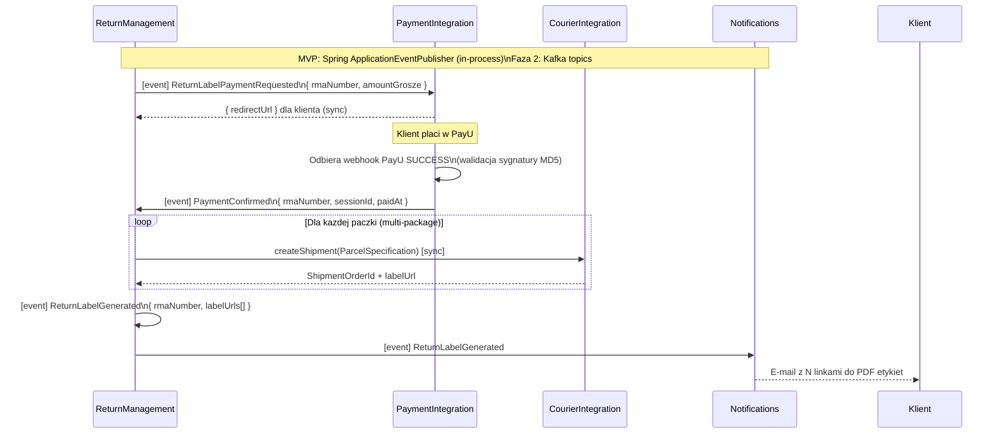
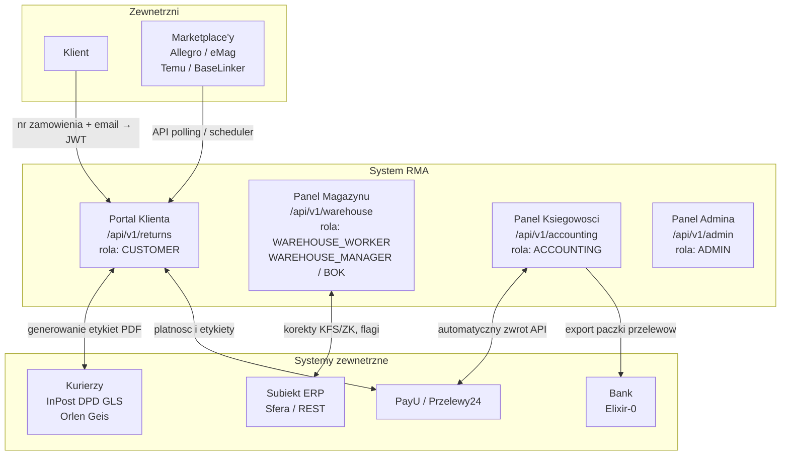
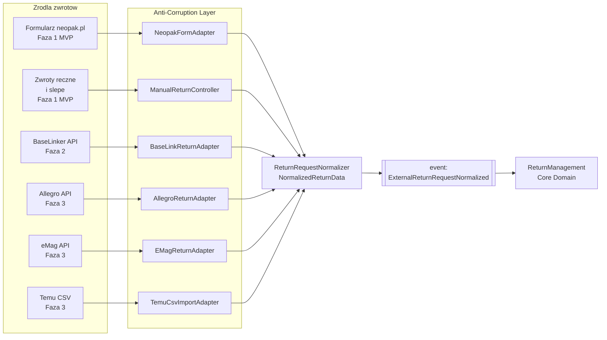

# Diagram cyklu zycia reklamacji RMA

## 1a. Maszyna stanow — pelny cykl zycia

---

## 1b. Podzial stanow na dzialy

---

## 2. Sciezka slepego zwrotu

---

## 3. Pelny przeplyw — diagram sekwencji

---

## 4. Saga: generowanie etykiety (choreography)

---

## 5. Mapa aktorow i uprawnien

---

## 6. Zrodla zwrotow — SourceAggregator

---

## 7. Legenda statusow

| Status | Wlasciciel | Opis |
|---|---|---|
| `PENDING_SHIPMENT` | System | Zgloszenie zlozoone, oczekiwanie na platnosc za etykiete |
| `IN_TRANSIT` | System | Etykieta oplacona i wygenerowana, paczka w drodze |
| `RECEIVED` | Magazynier | Paczka fizycznie przyjeta w magazynie, SLA 14 dni aktywne |
| `VERIFICATION` | Magazynier | Weryfikacja stanu towaru, upload zdjec |
| `DECISION` | BOK | Towar zweryfikowany, oczekiwanie na decyzje BOK |
| `AWAITING_REFUND` | Ksiegowosc | Decyzja pozytywna, oczekiwanie na realizacje przelewu |
| `REFUND_AND_DISPOSE` | System | Zwrot bez odsylania towaru — utylizacja na miejscu |
| `REJECTED` | BOK | Zgloszenie odrzucone, brak podstaw do zwrotu |
| `COMPLETED` | Ksiegowosc | Przelew zrealizowany, sprawa zamknieta |
| `BLIND_RECEIVED` | Magazynier | Paczka bez etykiety RMA, wymaga recznej identyfikacji |
